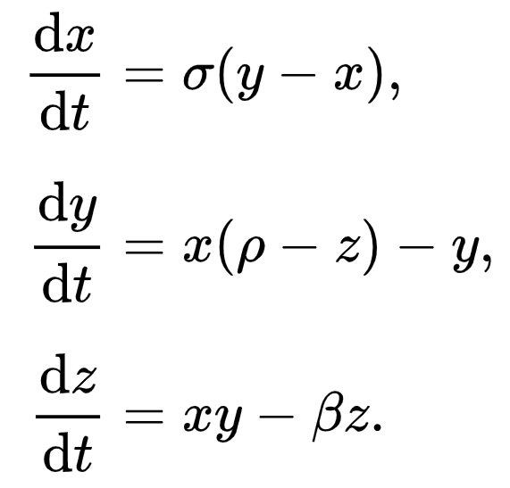
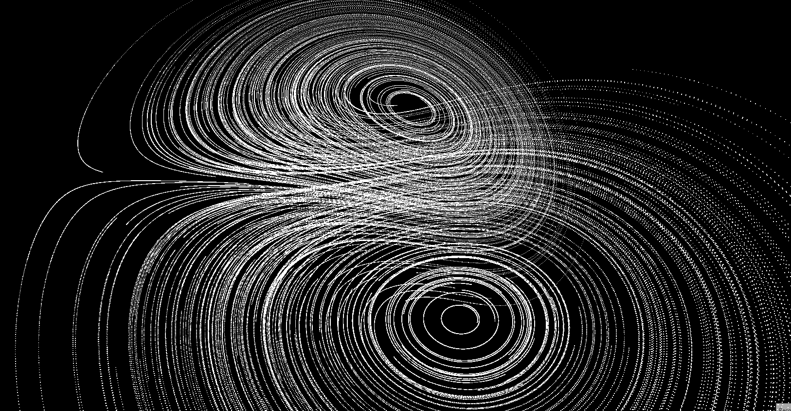
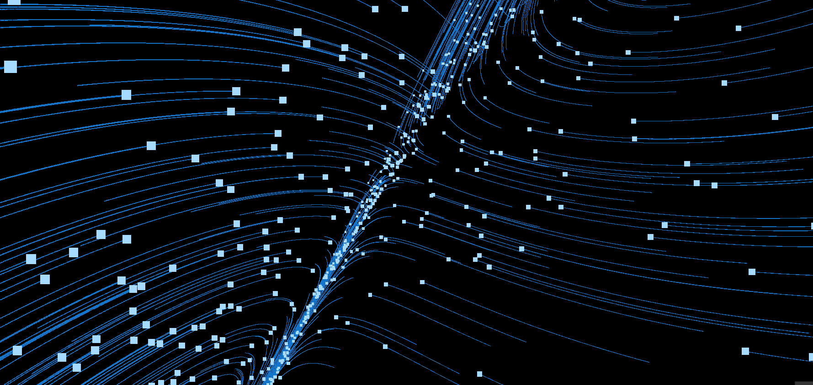

# Chaosvis

## [Hosted on GitHub pages](aarol.github.io/chaosvis/)

Chaosvis visualizes [the Lorenz system](https://en.wikipedia.org/wiki/Lorenz_system). When two points are put close to each other, the result will be drastically different. The Lorenz system/attractor is a [chaotic attractor](https://en.wikipedia.org/wiki/Chaos_theory).

## How it works

For every point in 3D-space, the following formula is calculated:

Where dt is the time between frames and σ, ρ, β are parameters. Play around with different parameters with the GUI.

---

---

### Made with Three.js, dat.GUI and Vite
